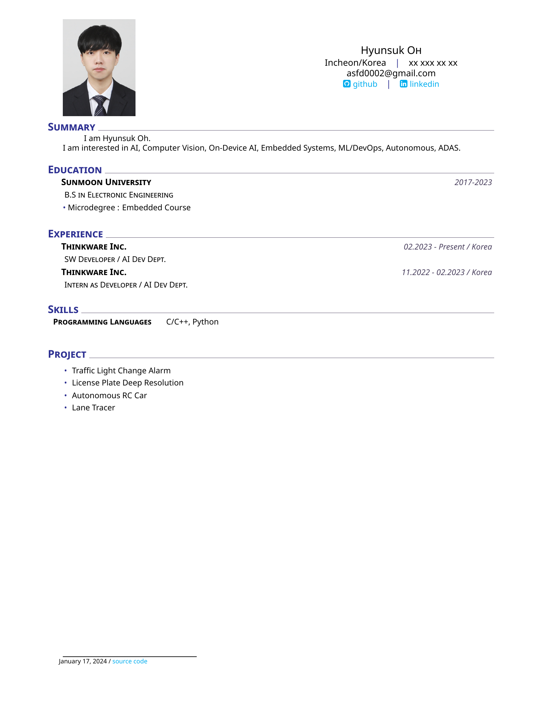

# HyunsukOh_CV


## Notes
* Should you require my phone number, please contact me through the email in CV.
* A portfolio is also being created.
* 더불어, Toy Project 등 자유로운 주제로 협업할 팀원도 찾습니다. 무언가 함께하고 싶다면 연락 주세요.

## Usage
```
$ git clone https://github.com/Uwaang/HyunsukOh_CV.git
$ cd HyunsukOh_CV
$ docker build -t uwaang/cv_image:1.0 --build-arg UID=$UID --build-arg USER_NAME=$USER -f Dockerfile .
$ docker run -it --rm --name cv_cont -v $PWD:/home/$USER/cv -w /home/$USER/cv -e DISPLAY=$DISPLAY -v /tmp/.X11-unix:/tmp/.X11-unix uwaang/cv_image:1.1
$ texworks ./cv.tex
$ chmod +X script.sh
$ ./script.sh
```
## References
* https://www.overleaf.com/latex/templates/murats-cv-template/gfwjwshrzqgd
* https://www.overleaf.com/latex/templates/awesome-cv/dfnvtnhzhhbm
* https://github.com/Taeyoung96/TaeyoungKim_CV
